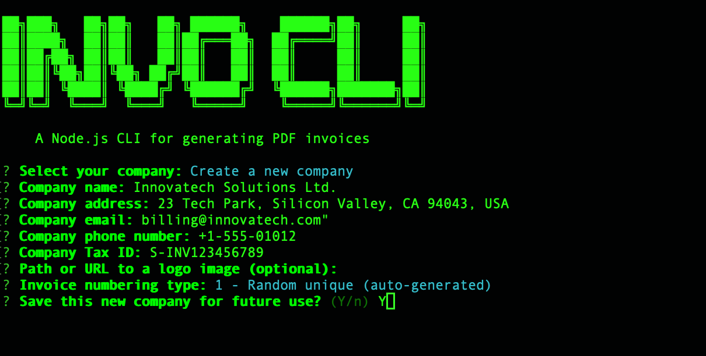
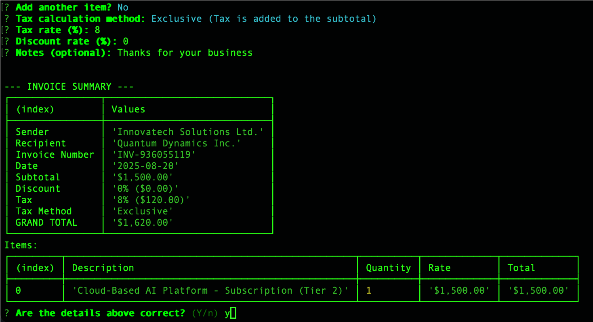

<br/>
<p align="center">
  <h3 align="center">InvoCLI</h3>
  <p align="center">
    The definitive command-line tool for fast, flexible, and automated PDF invoicing.
    <br/>
    <br/>
    <a href="https://www.npmjs.com/package/invocli"><strong>Explore the NPM Package »</strong></a>
    ·
    <a href="https://github.com/cemalidev/invocli/issues">Report Bug</a>
    ·
    <a href="https://github.com/cemalidev/invocli/issues">Request Feature</a>
  </p>
</p>

[](https://www.npmjs.com/package/invocli)
[](https://opensource.org/licenses/MIT)
[](https://nodejs.org/)

---

InvoCLI empowers developers, freelancers, and small businesses to manage the entire invoicing lifecycle directly from the command line. Ditch the slow web UIs and take back control of your workflow.



### Core Features

*   **🚀 Built for Speed**: Go from zero to a sent invoice in under a minute. No clicks, no page loads.
*   **🔒 Total Data Privacy**: Your data lives on your machine in simple JSON files. No cloud, no third-party access.
*   **🤖 Powerful Automation**: Integrate invoicing into any script or workflow. Automatically bill clients with cron jobs or CI/CD pipelines.
*   **✨ Smart Data Management**: Save and reuse company (sender) and customer (recipient) profiles so you never have to type the same address twice.
*   **🌍 Advanced Currency Formatting**: Automatic, locale-aware formatting for over 30 currencies.
*   **✅ Failsafe Confirmation**: A detailed summary table is shown for your approval before any file is created, preventing mistakes.

## 📦 Installation

Install InvoCLI globally using npm. This makes the `invocli` command available anywhere in your terminal.

```bash
npm install -g invocli
```

## 🚀 Getting Started: Your First Invoice

### Step 1: Create an Invoice Interactively
Run the `init` command to start the interactive wizard. It will guide you through every step, from selecting a client to adding line items.

```bash
invocli init
```

### Step 2: Review and Confirm
Before creating the PDF, InvoCLI shows you a complete summary. This is your chance to catch any errors.



If everything looks correct, confirm with "Yes", and your PDF will be generated in your current directory!

## 🛠️ Advanced Usage & Automation

### Generate from a JSON File
For full automation, create a JSON file with your invoice data and pass it to the `generate-from-file` command.

```bash
invocli generate-from-file invoice-data.json
```

### Manage Profiles
Save time by managing sender and recipient profiles directly.

```bash
# Manage your company/sender profiles
invocli company <add|list|update|remove>

# Manage your customer/recipient profiles
invocli customer <add|list|update|remove>
```

## 📘 Command Reference

| Command | Description |
| --- | --- |
| `invocli init` | Interactively create a new invoice. |
| `invocli generate-from-file <path>` | Create an invoice from a specified JSON file. |
| `invocli company <command>` | Manage saved sender (company) profiles. |
| `invocli customer <command>` | Manage saved recipient (customer) profiles. |
| `invocli generate [options]` | Create an invoice directly from command-line flags (for advanced scripting). |

## 🤝 Contributing

Contributions make the open-source community an amazing place. Any contributions you make are **greatly appreciated**. Please fork the repo and create a pull request.

## 📜 License

Distributed under the MIT License. See `LICENSE` file for more information.
